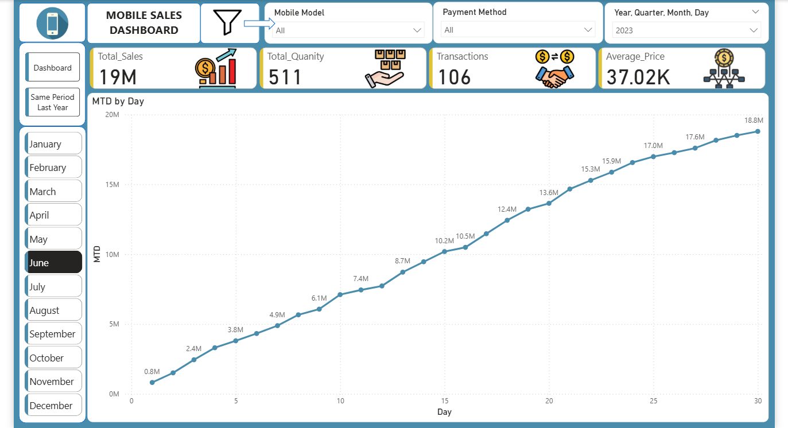
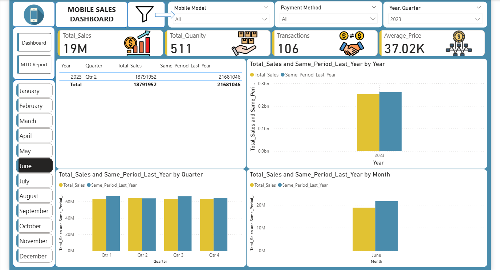

# 📱 Mobile Sales Analytics Dashboard

## 📖 Project Description
This Power BI project delivers a comprehensive analysis of mobile phone sales data across India from 2021 to 2024. The dashboard is designed to track high-level KPIs, monitor regional performance, and analyze customer purchasing behaviors. It features advanced time-intelligence reporting, including **Month-to-Date (MTD)** tracking and **Same Period Last Year (SPLY)** comparisons, providing stakeholders with actionable insights into growth trends and seasonality.

## 📊 Dashboard Features

### 1. **Executive Overview**
* **KPI Tracking:** Visualizes Total Sales (120M), Quantity Sold, and Transaction Volume.
* **Geospatial Analysis:** Bubble map highlighting top-performing cities (e.g., Mumbai, Delhi).
* **Payment Insights:** Breakdown of sales by payment methods (UPI, Credit Card, Cash, etc.).
* **Product Trends:** Sales ranking by Mobile Brand and specific Models.

### 2. **Time Intelligence Reports**
* **MTD Report:** Tracks cumulative performance for the current month against targets.
* **SPLY Analysis:** Compares current sales data with the exact period from the previous year to identify Year-over-Year growth.

## 📷 Screenshots

### **Main Dashboard**

### **MTD Report**

### **Same Period Last Year Comparison**

## 💾 Dataset Used
The analysis utilizes the `Mobile Sales Data.xlsx` dataset with the following key attributes:
* **Transaction Info:** Date, Transaction ID, Payment Method.
* **Product Details:** Brand, Mobile Model, Price, Units Sold.
* **Customer Data:** Name, Age, City, Ratings.

## 🛠️ Tools & Technologies
* **Microsoft Power BI:** For data visualization, DAX calculations, and reporting.
* **Microsoft Excel:** For initial data cleaning and storage.
* **DAX (Data Analysis Expressions):** Used for calculating complex measures like `Total Sales`, `MTD Sales`, and `SPLY Sales`.

## 🚀 How to Use
1.  Clone this repository.
2.  Open the `.pbix` file in **Power BI Desktop**.
3.  Connect the dashboard to the attached `Mobile Sales Data.xlsx` file if data refresh is required.
4.  Interact with the **Year** and **Brand** slicers to filter the views.
